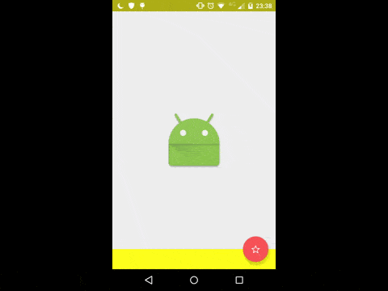

# MaterialContentOverflow

</img>

## Usage

MaterialContentOverflow is a ViewGroup, so you can put views inside it.
See the example app for more details.

```xml
<com.materialoverflowcontent.MaterialContentOverflow xmlns:android="http://schemas.android.com/apk/res/android"
    xmlns:app="http://schemas.android.com/apk/res-auto"
    android:layout_width="match_parent"
    android:layout_height="match_parent"
    app:fabButtonColor="@color/fab"
    app:buttonDrawable="@drawable/abc_btn_rating_star_off_mtrl_alpha"
    app:contentColor="@color/primary"
    app:buttonPosition="right">

    ...

<\com.materialoverflowcontent.MaterialContentOverflow>
```

## Gradle

```
compile 'com.materialcontentoverflow:materialcontentoverflow:1.0.0'
```